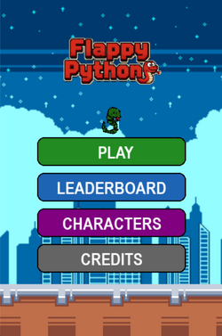
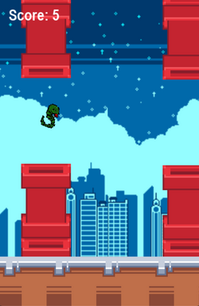
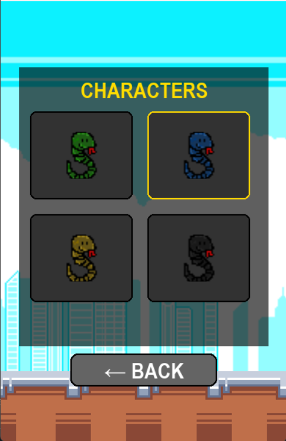
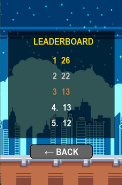
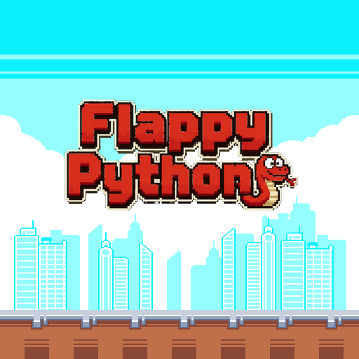

#  Flappy Python 
A Flappy Bird-inspired clone built with Python and pygame, developed as a personal learning project to explore game development fundamentals.

[](https://francescofalone.itch.io/flappy-python)
[](https://python.org)
[](https://pygame.org/)
[](LICENSE)


---

## 📸 Screenshots

<p align="center">
  
  
  
  
</p>

<p align="center">
  
</p>

---

# 🎮 Gameplay
- Press **SPACE** or click **▶ PLAY** to start
- Press **SPACE** to flap
- Avoid the pipes and the ground
- Try to beat your highest score
- Scores are automatically saved locally
- Unlock new snakes!

---

# ✨ Features
- Animated main menu
- Day / night cycle based on real local time
- Local Top 5 leaderboard system
- Credits screen
- Smooth scrolling background and ground
- Sound effects and background music
- Game Over screen with highlighted best score
- Mouse and keyboard support
- 4 different characters to choose from

---

# 🛠️ Requirements
Install pygame:
```bash
pip install pygame
```

---

# ▶️ Run from source
```bash
python main.py
```

---

# 📦 EXE Version
A standalone Windows `.exe` version will be available in the repository Releases section or in the official [itch.io page](https://francescofalone.itch.io/flappy-python).
The executable includes:
- all images
- sound effects
- music
- leaderboard support

No Python installation is required.

---

# 📁 Project Structure
```text
flappy-python/
│
├── assets/
│   │
│   ├── images/
│   │   ├── FlappyBird.png
│   │   ├── background_day.png
│   │   ├── background_night.png
│   │   ├── ground.png
│   │   ├── bird.png
│   │   ├── snake_red.png
|   |   ├── pipe.png
|   |   ├── snake_black.png
|   |   ├── snake_yellow.png
│   │   └── game_over.png
│   │
│   └── sounds/
│       └── defeat.wav
│    
├── data/
│   └── leaderboard.json
│
├── main.py
├── README.md
└── LICENSE
```

---

# 🧠 Concepts Covered
This project was built to practice:
- Object-oriented programming
- Game loop architecture
- State management
- Collision detection using `pygame.Rect`
- File handling with `json`
- Audio management with pygame mixer
- Smooth animations using math functions
- Keyboard and mouse event handling

---

# 🎨 Screens Included
- Main Menu
- Gameplay
- Leaderboard
- Credits
- Game Over
- Characters

---

# ❤️ Contributors
Huge thanks to everyone whose work helped bring this project to life:

- **[messmeme](https://itch.io/profile/messmeme)** — pixel art assets
- **[MegaCrash](https://itch.io/profile/megacrash)** — pixel art assets
- **[Pixabay.com](https://pixabay.com)** — sound effects

---

# ⚠️ Disclaimer
This project was created for educational and personal purposes only.
The original Flappy Bird concept belongs to Dong Nguyen.
This repository is not affiliated with or endorsed by the original creator.
All included graphics and audio assets are free assets used for this project.

---

# 👨‍💻 Author
**Francesco Falone**
Personal project made to improve Python and pygame development skills.

---

# 📄 License
This project is licensed under the MIT License.
